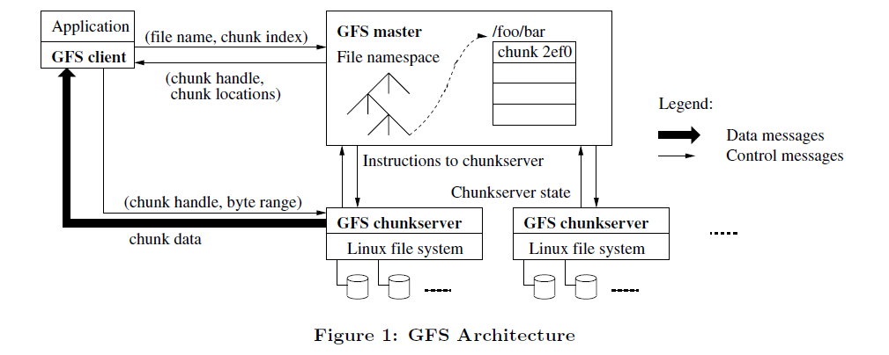
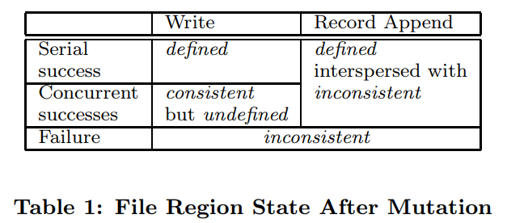
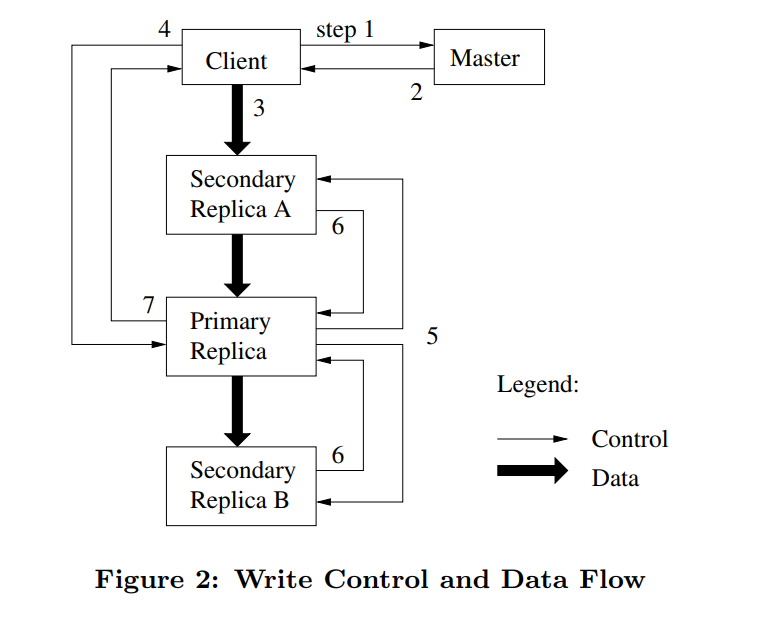

# The Google File System

## Outline
- reexamining traditional file system assumptions in light of our current and anticipated application
workloads and technological environment.
- We treat component failures as the norm rather than the
exception
- Our system provides fault tolerance by constant monitoring, replicating crucial data, and fast and automatic recovery
- Our design delivers high aggregate throughput to many
concurrent readers and writers performing a variety of tasks.
___
## Abstract
- GFS: a scalable distributed file system for large distributed
data-intensive applications.
    - fault tolerance
    - high aggregate performance
___
## introduction
-  GFS is driven by key observation of application workloads and technological environment

- Reexamination
    - First, component failures are the norm(标准) rather than the
    exception.
    - Second, files are huge by traditional standards. 
    - Third, most files are mutated by appending new data
    rather than overwriting existing data.
    - Fourth, co-designing the applications and the file system API benefits the overall system by increasing our flexibility.

___

## Design Overview

### Assuptions

- built on commodity components that may fail
- The system stores a modest number of large files
- Reads:
    1. large streaming read
    2. small random read
- Writes:
    - large append
    - random and small write 
- The system must efficiently implement well-defined semantics
for multiple clients that concurrently append
to the same file.
    - Our files are often used as producerconsumer
queues or for many-way merging
- High sustained bandwidth is more important than low
latency.

### Interface
- does not implement a standard API like POSIX
- but support usual operations like create, delete, open...
- Moreover, GFS support *snapshot*, **record append** which is useful for multi-way merge and producer-consumer queues that many clients can simultaneously append
to without additional locking.

### Architecture

- GFS consists of a single master and multiple *chunkservers* and is accessed by multiple *clients* 
- Files are divided into fixed-size chunks.
    - Each chunk is identified by an immutable and globally unique 64 bit chunk handle assigned by the master at the time of chunk creation.
    - For reliability, each chunk is replicated on multiple chunkservers. By default, we store three replicas.
- The master maintains all file system metadata.
>The master periodically communicates with each chunkserver in HeartBeat messages to give it instructions and collect its state.
- GFS client code linked into each application implements
the file system API and communicates with the master and
chunkservers to read or write data on behalf of the application.
- Clients never read
and write file data through the master.(for the sake of efficiency) Clients ask for which chunkservers it should contact.

#### Single read 
1. Clients translates the file name and byte offset into a chunk index.
2. Then Clients send the master a request containing the file name and chunk index.
3. The masters reply with the corresponding chunk handle and locations of replicas.
4. The clients caches the information and use the file name and chunk index as the key.
5. The clients then send a request to one of the replicas usually the closest one. The request specifies the chunk handle and byte range within that chunk.
6. Further read require no extra client-master interaction until the cached information expires or the file is reopened.

### Chunk Size 
- 64MB bigger than typical file system block sizes.
- Advantages:
    1. reduce clients's need to interact with the master.
    2. since on a large chunk, a client is more likely to perform many operations on a given chunk. 
    3. it reduces the size of the metadata stored on the master
- disadvantage:
1. small file consists of a small number of chunks, perhaps just one. The chunkservers storing those chunks may become hot spots(especially: executable file in GFS)
> solve: storing such executables with a higher replication factor and by making the batchqueue system stagger application start times.

### Meta Data

- 3 major types of meta data: 
    
    the file and chunk namespaces, the mapping from files to chunks, and the locations of each chunk's memory. (in memory)
- The first two types will be kept persistent by logging. The chunk location information instead will be record when the master start up and whenever a chunkserver joins the cluster.

### chunk location 
- The master does not keep the record of which chunkservers have a replica of given chunk. It polls chunkservers with *HeartBeat* messages.
- polling makes it easy to sync. 

### Operation Log
- Not only is it the only persistent record of metadata, but it also serves as a logical time line that defines the order of concurrent operations.

### Consistency Model

>A write causes data to be written at an application-specified file offset

>A record append causes data (the “record”) to be appended atomically at least once even in the presence of concurrent mutations, but at an offset of GFS’s choosing
(Section 3.3). 
- File namespace mutations (e.g., file creation) are atomic.
- A file region is consistent if all clients will always see the same data, regardless of which replicas they read from.
- A region is defined after a file data mutation if it is consistent and clients will see what the mutation writes in its entirety. 
- When a mutation succeeds without interference
from concurrent writers, the affected region is defined (and by implication consistent): all clients will always see what the mutation has written. 
- Concurrent successful mutations leave the region undefined but consistent: all clients see the same data, but it may not reflect what any one mutation has written.

___

## System Interactions

- Leases and mutation order:

    We use leases to maintain a consistent mutation order across replicas. 

    The master grants a chunk lease to one of the replicas, which we call the primary.The primary picks a serial order for all mutations to the chunk. All replicas follow this order when applying mutations. 

    
    
    1. The client asks the master which chunkserver holds the current lease for the chunk and the locations of the other replicas. If no one has a lease, the master grants one to a replica it chooses (not shown).
    2. The master replies with the identity of the primary and the locations of the other (secondary) replicas. The client caches this data for future mutations. It needs to contact the master again only when the primary becomes unreachable or replies that it no longer holds a lease.
    
    3. The client pushes the data to all the replicas. A client can do so in any order. Each chunkserver will store the data in an internal LRU buffer cache until the data is used or aged out. By decoupling the data flow from the control flow, we can improve performance by scheduling the expensive data flow based on the network topology regardless of which chunkserver is the primary. Section 3.2 discusses this further.
    
    4. Once all the replicas have acknowledged receiving the Data, the client sends a write request to the Primary. The request identifies the data pushed earlier To all of The replicas. The primary assigns consecutive Serial Numbers to all the mutations it receives, Possibly from Multiple clients, which provides the necessary Serialization. It applies the mutation to its Own local state In serial number order.

    5. The primary forwards the write request to all secondary replicas. Each secondary replica applies mutations in the same serial number order assigned by the primary

    6. The secondaries all reply to the primary indicating that they have completed the operation.

    7. The primary replies to the client. Any errors encountered at any of the replicas are reported to the clien In case of errors, the write may have succeeded at the primary and an arbitrary subset of the secondary replicas. (If it had failed at the primary, it would no have been assigned a serial number and forwarded.)  The client request is considered to have failed, and the modified region is left in an inconsistent state. Our client code handles such errors by retrying the fail mutation. It will make a few attempts at steps (3) through (7) before falling back to a retry from the beginning of the write.

- Data Flow

    To fully utilize each machine’s network bandwidth, the data is pushed linearly along a chain of chunkservers rather than distributed in some other topology (e.g., tree). Thus, each machine’s full outbound bandwidth is used to transfer the data as fast as possible rather than divided among multiple recipients.