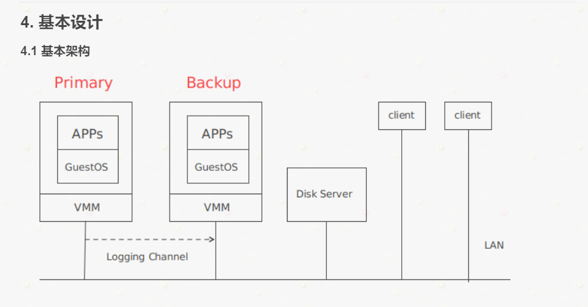
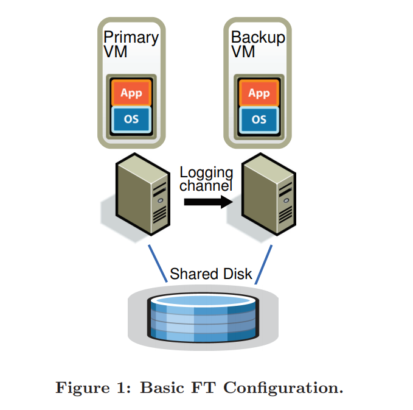
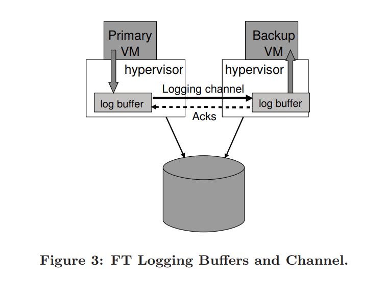

# The Design of a Practical System for Fault-Tolerant Virtual Machines

## Abstract
- implemented a commercial enterprise-grade system
for providing fault-tolerant virtual machines, based on the
approach of replicating the execution of a primary virtual
machine (VM) via a backup virtual machine on another
server.

## Introduction
A common approach to implementing fault-tolerant servers is the primary/backup approach
1. ship changes to all state of the primary(bandwidth consuming)
2. model the servers as deterministic state machines that are kept in sync by starting them from the same initial state and ensuring that they receive the same input requests in the same order.
Since most servers or services have some operations that are not deterministic, extra coordination must be used to ensure that a primary and backup are kept in sync

In addition to providing hardware fault tolerance, our system automatically restores redundancy after a failure by starting a new backup virtual machine on any available server in the local cluster

>First, we describe our basic design and detail our fundamental protocols that ensure that no data is lost if a backup VM takes over after a primary VM fails. Then, we describe in detail many of the practical issues that must be addressed to build a robust, complete, and automated system. We also describe several design choices that arise for implementing fault-tolerant VMs and discuss the tradeoffs in these choices. Next, we give performance results for our implementation for some benchmarks and some real enterprise applications. Finally, we describe related work and conclude

## Basic FT DESIGN
- All input that the primary VM receives is sent to the backup VM via a network connection known as the logging channel. 

- Additional information, as discussed below in Section 2.1, is transmitted as necessary to ensure that the backup VM executes non-deterministic operations in the same way as the primary VM. The result is that the
backup VM always executes identically to the primary VM.
However, the outputs of the backup VM are dropped by the hypervisor, so only the primary produces actual outputs that are returned to clients

### Deterministic Replay Implementation

- To detect if a primary or backup VM has failed, our system uses a combination of heartbeating between the relevant servers and monitoring of the traffic on the **logging channel.**

- A virtual machine has a broad set of inputs, including incoming network packets, disk reads, and input from the keyboard and mouse. Non-deterministic events (such as virtual interrupts) and non-deterministic operations (such as reading the clock cycle counter of the processor) also affect the VM’s state.
  - This presents three challenges for replicating execution of any VM running any operating system and workload:
    1. correctly capturing all the input and non-determinism necessary to ensure deterministic execution of a backup virtual machine
    2. correctly applying the inputs and nondeterminism to the backup virtual machine
    3. doing so in a manner that doesn’t degrade performance. In addition, many complex operations in x86 microprocessors have undefined, hence non-deterministic, side effects. Capturing these undefined side effects and replaying them to produce the same state presents an additional challenge

### FT protocol

- For VMware FT, we use deterministic replay to produce the necessary log entries to record the execution of the primary VM, but instead of writing the log entries to disk, we send them to the backup VM via the **logging channel**.
>Output Requirement: if the backup VM ever takes over after a failure of the primary, the backup VM will continue executing in a way that is entirely consistent with all outputs that the primary VM has sent to the external world

- After failover, the clients will notice no interruption or inconsistency in their service

>Output Rule: the primary VM may not send an output to the external world, until the backup VM has received and acknowledged the log entry associated with the operation producing the output

### Detecting and Responding to Failure
1. backup failure: primary stops sending entries on the logging channel.
2. primary failure: backup go live 

VMware FT uses UDP heartbeating between servers that are running fault-tolerant VMs to detect when a server may have crash. in addition, acknowledgments are sent from the backup VM to the primary VM.

To avoid split-brain problems, we make use of the shared storage that stores the virtual disks of the VM.
为解决 split-brain 问题，使 Disk Server 支持 atomic test-and-set 测试，即在 Disk Server 上维护一个 flag ，第一个访问此 flag 的 VM 会成为 primary ，第二个访问此 flag 的 VM 不会上线 。（ 类似于锁 ）

## Practical implementation

### Staring and Restarting FT VMs
- We created a modified form of VMotion that creates an exact running
copy of a VM on a remote server, but without destroying the VM on the local server(clone to a remote place rather than migrating it).
### Implementation Issues for Disk IOs
- disk operations are non-block and can execute in parallel. 
solution: generally to detect any such IO races, and force such racing disk operations to execute sequentially in the same way on the primary and backup.
- Bounce buffer: a temporary buffer that has the same size  as the memory being accessed by a disk operation.(使用 bounce buffer 确保读写磁盘的determinant)
## Link
[chinese](https://www.cnblogs.com/brianleelxt/p/13245754.html)