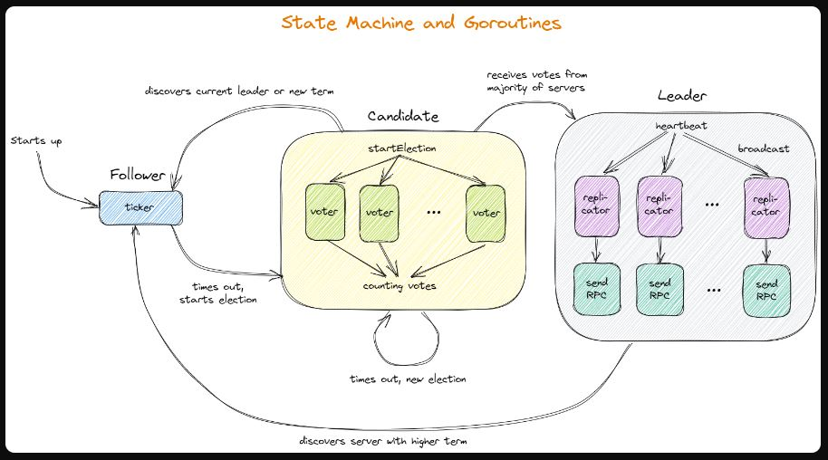

# In Search of an Understandable Consensus Algorithm (Extended Version)


## Abstract
    In order to enhance understandability,Raft separates the key elements ofconsensus, such as leader election, logreplication, and safety, and itenforces a stronger degree of coherencyto reduce the number of states that must be considered.
## introduction
### novel features:
- strong leader
- leader election
- Membership changes *joint consensus*

## Replicated state machines

### problem fomulation:

- State machines on a collection of servers compute identical copies of the same state and can continue operating even if some of the servers are down.
- replicated state machines are used to solve a variety of fault tolerance problems in distributed systerms. 


### Consensus algorithms for practical systems typically have the following properties:

- They ensure safety (never returning an incorrect result) under all non-Byzantine conditions, including network delays, partitions, and packet loss, duplication, and reordering.

    >一般地，把出现故障( crash 或 fail-stop，即不响应)但不会伪造信息的情况称为“非拜 占庭错误”( non-byzantine fault)或“故障错误”( Crash Fault);伪造信息恶意响应的情况称为“拜占庭错误”( Byzantine Fault)，对应节点为拜占庭节点.<br>

    >处理非拜占庭错误的算法有：paxos、raft和其变种 处理拜占庭错误算法有：pbft、pow算法<sup>[[1]](https://blog.csdn.net/wahaha13168/article/details/80808220)

- They are fully functional (available) as long as any majority of the servers are operational and can communicate with each other and with clients. Thus, a typical cluster of five servers can tolerate the failure of any two servers. Servers are assumed to fail by stopping; they may later recover from state on stable storage and rejoin the cluster.

- They do not depend on timing to ensure the consistency of the logs: faulty clocks and extreme message delays can, at worst, cause availability problems.

-  In the common case, a command can complete as soon as a majority of the cluster has responded to a single round of remote procedure calls; a minority of slow servers need not impact overall system performance.


## RAFT
**In Raft we separated leader
election, log replication, safety, and membership changes.**

    Raft implements consensus by first electing a distinguished leader, then giving the leader complete responsibility for managing the replicated log. The leader accepts log entries from clients, replicates them on other servers, and tells servers when it is safe to apply log entries to their state machines. Having a leader simplifies the management of the replicated log. For example, the leader can decide where to place new entries in the log without consulting other servers, and data flows in a simple fashion from the leader to other servers. A leader can fail or become disconnected from the other servers, in which case a new leader is elected.

- Leader election
- Log replication
- Safety 

### State

### AppendEntries

### RequestVote

### rules


## Leader election

Leaders send periodic heartbeats (AppendEntries RPCs that carry no log entries) to all followers in order to maintain their authority. 

If a follower receives no communication over a period of time called the election timeout, then it assumes there is no viable leader and begins an election to choose a new leader.


    It then votes for itself and issues RequestVote RPCs in parallel to each of the other servers in the cluster. A candidate continues in this state until one of three things happens: 
    (a) it wins the election, 
    (b) another server establishes itself as leader, or
    (c) a period of time goes by with no winner. These outcomes are discussed separately in the paragraphs below


---
    While waiting for votes, a candidate may receive an AppendEntries RPC from another server claiming to be leader. If the leader’s term (included in its RPC) is at least as large as the candidate’s current term, then the candidate recognizes the leader as legitimate and returns to follower state.If the term in the RPC is smaller than the candidate’s current term, then the candidate rejects the RPC and continues in candidate state.

---
    Raft uses randomized election timeouts to ensure that split votes are rare and that they are resolved quickly. To prevent split votes in the first place, election timeouts are chosen randomly from a fixed interval (e.g., 150–300ms).

## Log replication

A log entry is committed once the leader
that created the entry has replicated it on a majority of the servers (e.g., entry 7 in Figure 6).

**Log Matching Property**

    If two entries in different logs have the same index and term, then they store the same command.
    • If two entries in different logs have the same index and term, then the logs are identical in all preceding entries.

The second property is guaranteed by a simple consistency check performed by AppendEntries. When sending an AppendEntries RPC, the leader includes the index and term of the entry in its log that immediately precedes the new entries. If the follower does not find an entry in its log with the same index and term, then it refuses the new entries. The consistency check acts as an induction
step: the initial empty state of the logs satisfies the Log Matching Property, and the consistency check preserves the Log Matching Property whenever logs are extended. As a result, whenever AppendEntries returns successfully, the leader knows that the follower’s log is identical to its
own log up through the new entries


### one condition that leader fails

    In Raft, the leader handles inconsistencies by forcing the followers’ logs to duplicate its own. This means that conflicting entries in follower logs will be overwritten with entries from the leader’s log. Section 5.4 will show that this is safe when coupled with one more restriction.

Solution:

To bring a follower’s log into consistency with its own, the leader must find the latest log entry where the two logs agree, delete any entries in the follower’s log after that point, and send the follower all of the leader’s entries after that point.The leader maintains a nextIndex for each follower, which is the index of the next log entry the leader will send to that follower. When a leader first comes to power, it initializes all nextIndex values to the index just after the
last one in its log (11 in Figure 7). 


## safty

    The RequestVote RPC implements this restriction: the RPC includes information about the candidate’s log, and the voter denies its vote if its own log is more up-to-date than that of the candidate.
    
    Raft determines which of two logs is more up-to-date by comparing the index and term of the last entries in the logs. If the logs have last entries with different terms, then the log with the later term is more up-to-date. If the logs end with the same term, then whichever log is longer is more up-to-date.

---


To eliminate problems like the one in Figure 8, Raft
never commits log entries from previous terms by counting replicas. Only log entries from the leader’s current term are committed by counting replicas; once an entry from the current term has been committed in this way, then all prior entries are committed indirectly because of the Log Matching Property. There are some situations
where a leader could safely conclude that an older log entry is committed (for example, if that entry is stored on every server), but Raft takes a more conservative approach
for simplicity.

### Election restriction


## Cluster membership changes

In Raft the cluster first switches to a transitional configuration we call joint
consensus; once the joint consensus has been committed, the system then transitions to the new configuration. The joint consensus combines both the old and new configurations:
- Log entries are replicated to all servers in both configurations.
- Any server from either configuration may serve as
leader
- Agreement (for elections and entry commitment) requires separate majorities from both the old and new configurations.


- The first issue is that new servers may not initially store any log entries. If they are added to the cluster in this state, it could take quite a while for them to catch up, during which time it might not be possible to commit new log entries. In order to avoid availability gaps, Raft introduces an additional phase before the configuration change, in which the new servers join the cluster
as non-voting members (the leader replicates log entries to them, but they are not considered for majorities). Once the new servers have caught up with the rest of the cluster, the reconfiguration can proceed as described above.
- The second issue is that the cluster leader may not be part of the new configuration. In this case, the leader steps down (returns to follower state) once it has committed the Cnew log entry. This means that there will be a period of time (while it is committingCnew) when the leader is managing a cluster that does not include itself; it replicates log entries but does not count itself in majorities. The leader transition occurs when Cnew is committed because this is the first point when the new configuration can operate independently (it will always be possible to choose a leader from Cnew). Before this point, it may be the case that only a server from Cold can be elected leader.

- The third issue is that removed servers (those not in Cnew) can disrupt the cluster. These servers will not receive heartbeats, so they will time out and start new elections. They will then send RequestVote RPCs with new term numbers, and this will cause the current leader to revert to follower state. A new leader will eventually be elected, but the removed servers will time out again and the process will repeat, resulting in poor availability

## Implementation details

### Leader election

#### Leaders:

#### Follower:
- A server remains in follower state as long as it receives valid RPCs from a leader or candidate.

- If a follower receives no communication over a period of time called the *election timeout*

#### Candidate:
- To begin an election, a follower increments its current
term and transitions to candidate state. It then votes for itself and issues RequestVote RPCs in parallel to each of the other servers in the cluster. A candidate continues in this state until one of three things happens: 
    - (a) it wins the election, 
    - (b) another server establishes itself as leader, or 
    - (c) a period of time goes by with no winner. These outcomes are discussed separately in the paragraphs below.(increment term and initiating another round of RequestVote RPCs justified by random election timeout)

- Each server will vote for at most one candidate in *a given term*, on a first-come-first-served basis

### Log replication

#### Leader:
- If followers crash or run slowly, or if network packets are lost, the leader retries AppendEntries RPCs indefinitely (even after it has responded to the client) until all followers eventually store all log entries.

- The leader decides when it is safe to apply a log entry to the state machines(committed); 
    >A log entry is committed once the leader that created the entry has replicated it on a majority of the servers (e.g., entry 7 in Figure 6).

- **The leader keeps track of the highest index it knows to be committed, and it includes that index in future AppendEntries RPCs (including heartbeats) so that the other servers eventually find out. Once a follower learns that a log entry is committed, it applies the entry to its local state machine (in log order).**(这样可以确保已经复制了的entry最终可以被apply)

- The leader maintains a nextIndex for each follower, which is the index of the next log entry the leader will send to that follower. When a leader first comes to power, it initializes all nextIndex values to the index just after the last one in its log (11 in Figure 7).

- If a follower’s log is
inconsistent with the leader’s, the AppendEntries consistency check will fail in the next AppendEntries RPC. After a rejection, the leader decrements nextIndex and retries
the AppendEntries RPC. Eventually nextIndex will reach a point where the leader and follower logs match. When this happens, AppendEntries will succeed, which removes
any conflicting entries in the follower’s log and appends entries from the leader’s log (if any). Once AppendEntries succeeds, the follower’s log is consistent with the leader’s,
and it will remain that way for the rest of the term.
- A leader never overwrites or
deletes entries in its own log (the Leader Append-Only
Property in Figure 3).
- **To eliminate problems like the one in Figure 8, Raft
never commits log entries from previous terms by counting replicas. Only log entries from the leader’s current
term are committed by counting replicas; once an entry
from the current term has been committed in this way,
then all prior entries are committed indirectly because
of the Log Matching Property.**
#### log backtracking optimization
- If a follower does not have ```prevLogIndex``` in its log, it should return with ```conflictIndex = len(log)``` and ```conflictTerm = None```.
- If a follower does have ```prevLogIndex``` in its log, but the term does not match, it should return ```conflictTerm = log[prevLogIndex].Term```, and then search its log for the first index whose entry has term equal to ```conflictTerm```.

- Upon receiving a conflict response, the leader should first search its log for ```conflictTerm```. If it finds an entry in its log with that term, it should set ```nextIndex``` to be the one beyond the index of the last entry in that term in its log.
- If it does not find an entry with that term, it should set ```nextIndex = conflictIndex.```

#### Solve inconsistency 
- To bring a follower’s log into consistency with its own, the leader must find the latest log entry where the two logs agree, delete any entries in the follower’s log after
that point, and send the follower all of the leader’s entries after that point. 

#### Strong consistency

    - definition: If called one at a time, the Get/Put/Append methods should act as if the system had only one copy of its state, and each call should observe the modifications to the state implied by the preceding sequence of calls. For concurrent calls, the return values and final state must be the same as if the operations had executed one at a time in some order.

    Furthermore, a call must observe the effects of all calls that have completed before the call starts (so we are technically asking for linearizability).

---
## Link
### [chinese translation](https://zhuanlan.zhihu.com/p/65402077)

### [blog](https://zhuanlan.zhihu.com/p/32052223)

### [[1]](https://blog.csdn.net/wahaha13168/article/details/80808220)

### [students-guide-to-raft](https://thesquareplanet.com/blog/students-guide-to-raft/)